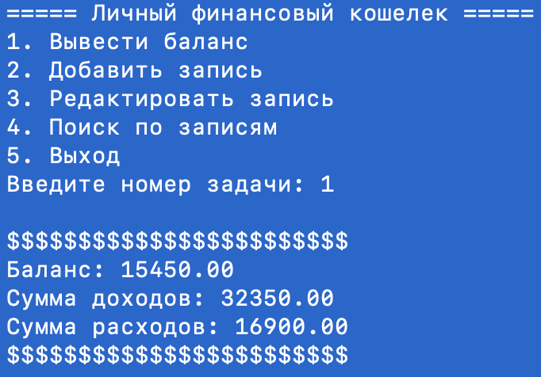

# Личный финансовый кошелек

Консольное приложение для учета личных финансов. С его помощью пользователь может отслеживать свои доходы и расходы, анализировать свои финансовые потоки.

## Приложение позволяет:

- добавлять новые записи о доходах или расходах с указанием даты, категории, суммы и описания;
- хранить информацию о доходах и расходах в файле .txt;
- редактировать существующие записи;
- находить нужные записи по различным критериям: категории, дате, сумме;

## Установка

1. Клонируйте репозиторий на свой локальный компьютер.
2. Запустите приложение, выполнив `python main.py`.
3. В появившемся меню выберите нужную задачу.

## Пример работы приложения

